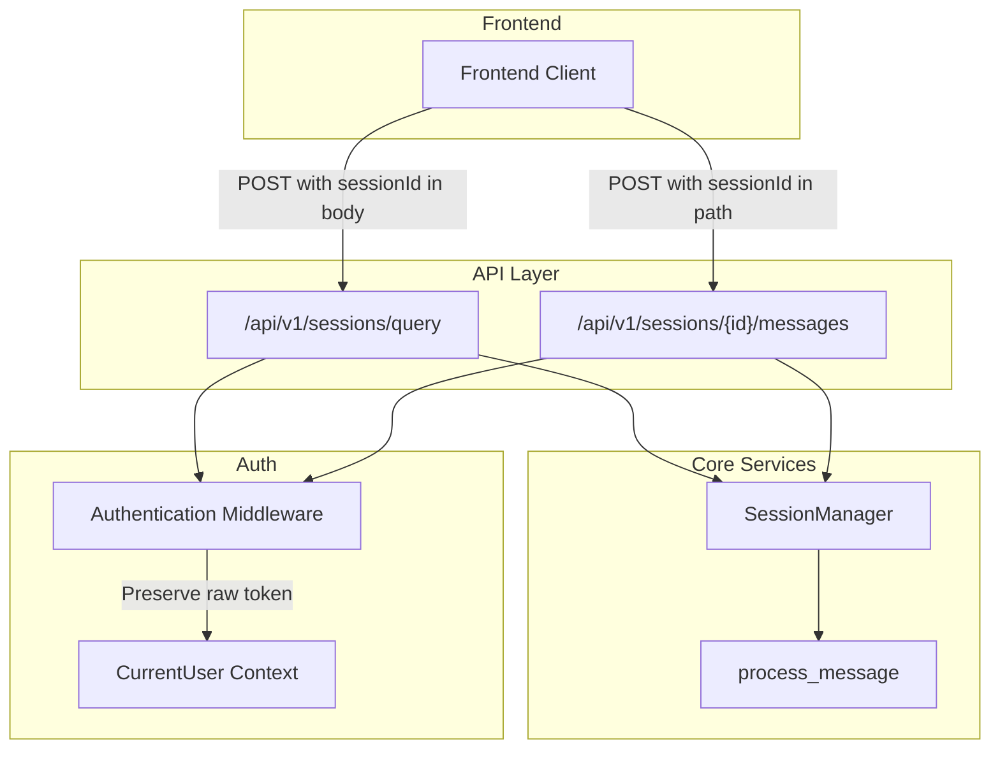
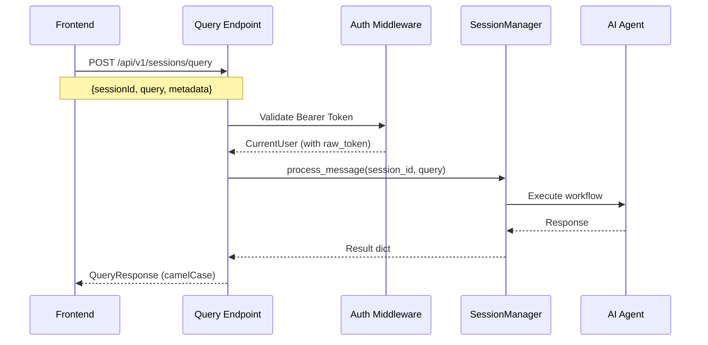
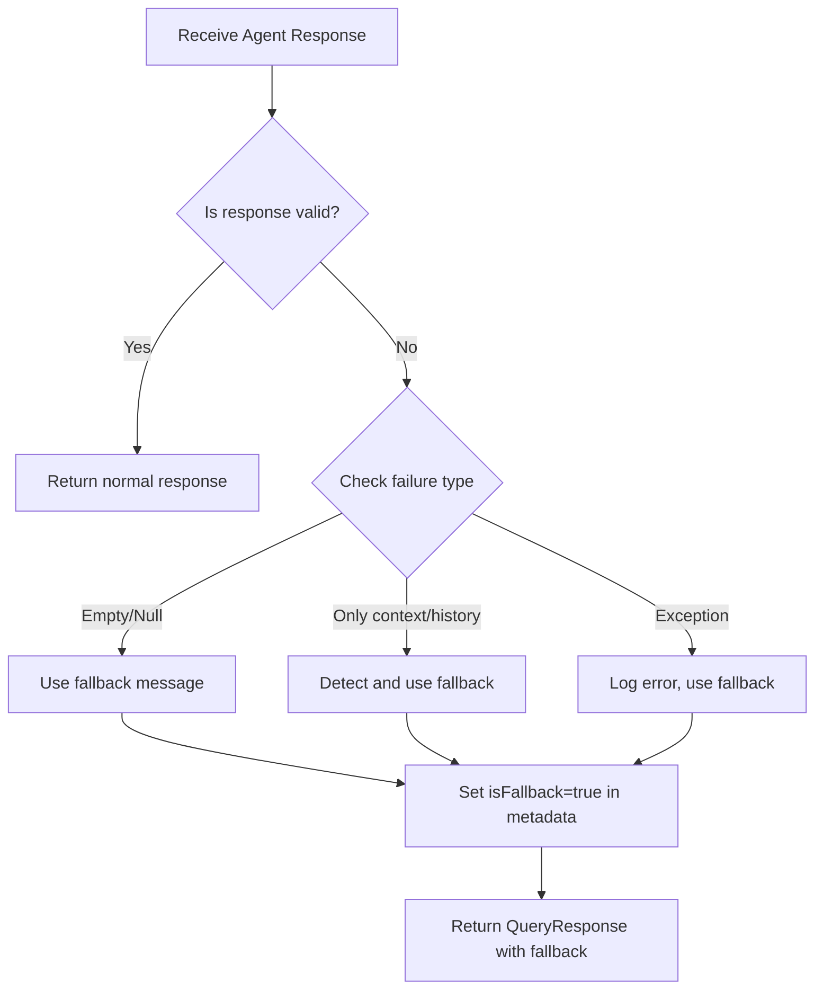

# Design Document: Message API Refactor

## Overview

This design document outlines the implementation of a new query endpoint (`/api/v1/sessions/query`) for the orchestration service. The refactoring introduces a body-parameter-based approach for sending messages, where the `sessionId` is included in the request body rather than as a path parameter. This change simplifies frontend integration while maintaining backward compatibility with the existing endpoint.

## Architecture

The new query endpoint will be implemented as an additional route in the existing sessions router, reusing the core session management and message processing infrastructure.



## Components and Interfaces

### New DTOs

#### QueryRequest DTO
```python
class QueryRequest(BaseModel):
    """Request DTO for the query endpoint."""
    
    sessionId: str = Field(
        description="Session identifier",
        alias="sessionId"
    )
    query: str = Field(
        description="The message/query content",
        min_length=1
    )
    pattern: Optional[ConversationPattern] = Field(
        default=None,
        description="Conversation pattern to use (optional)"
    )
    maxTurns: Optional[int] = Field(
        default=None,
        description="Maximum conversation turns (optional)",
        alias="maxTurns"
    )
    metadata: Dict[str, Any] = Field(
        default_factory=dict,
        description="Additional metadata"
    )
    
    class Config:
        populate_by_name = True
```

#### QueryResponse DTO
```python
class QueryResponse(BaseModel):
    """Response DTO for the query endpoint."""
    
    sessionId: str = Field(description="Session identifier")
    response: str = Field(description="AI agent response")
    turnCount: int = Field(description="Current turn count")
    chatHistory: List[Dict[str, Any]] = Field(
        default_factory=list,
        description="Conversation history"
    )
    summary: str = Field(default="", description="Conversation summary")
    safetyPassed: bool = Field(default=True, description="Content safety check result")
    cost: Dict[str, Any] = Field(default_factory=dict, description="Cost information")
    metadata: Dict[str, Any] = Field(default_factory=dict, description="Response metadata")
    
    class Config:
        populate_by_name = True
```

### API Endpoint

```python
@router.post("/query", response_model=QueryResponse)
async def query_session(
    request: Request,
    body: QueryRequest,
    current_user: CurrentUser = Depends(require_user),
) -> QueryResponse:
    """
    Send a query to a session and get a response.
    
    This endpoint accepts the sessionId in the request body for simplified
    frontend integration.
    """
```

### Authentication Token Handling

The `CurrentUser` model already includes a `raw_token` field. The design ensures:

1. The Keycloak middleware extracts and preserves the raw JWT token
2. The token is stored in `CurrentUser.raw_token` without modification
3. The token is forwarded to tool execution context for external API calls

## Data Models

### Request Flow



### DTO Field Mapping

| Internal Field | DTO Field (camelCase) | Type |
|---------------|----------------------|------|
| session_id | sessionId | string |
| message | query | string |
| turn_count | turnCount | int |
| chat_history | chatHistory | array |
| safety_passed | safetyPassed | boolean |
| max_turns | maxTurns | int |
| is_fallback | isFallback | boolean |

## Graceful Error Handling (Fallback Response)

When the AI agent or workflow fails to generate a proper response, the system must return a user-friendly fallback message instead of exposing raw conversation history or internal context.

### Fallback Response Logic



### Response Validator

```python
class ResponseValidator:
    """Validates and sanitizes AI agent responses."""
    
    DEFAULT_FALLBACK = (
        "I apologize, but I was unable to process your request. "
        "Please try again or rephrase your question."
    )
    
    @staticmethod
    def is_valid_response(response: str) -> bool:
        """Check if response is a valid user-facing answer."""
        if not response or not response.strip():
            return False
        
        # Detect if response is just raw context/history
        invalid_patterns = [
            "Previous conversation context",
            "[Current message]",
            "User:",
            "Assistant:",
        ]
        
        # If response starts with these patterns, it's likely raw context
        for pattern in invalid_patterns:
            if response.strip().startswith(pattern):
                return False
        
        return True
    
    @staticmethod
    def get_fallback_response(
        original_response: str,
        custom_message: Optional[str] = None
    ) -> str:
        """Return fallback message, logging original for debugging."""
        logger.warning(
            "Using fallback response",
            original_response_length=len(original_response) if original_response else 0,
            original_preview=original_response[:100] if original_response else None,
        )
        return custom_message or ResponseValidator.DEFAULT_FALLBACK
```

### QueryResponse with Fallback Flag

The `QueryResponse` DTO includes metadata to indicate when a fallback response was used:

```python
class QueryResponse(BaseModel):
    # ... existing fields ...
    metadata: Dict[str, Any] = Field(default_factory=dict)
    
    # metadata will contain:
    # {
    #     "isFallback": true,  # When fallback was used
    #     "fallbackReason": "empty_response" | "invalid_format" | "exception"
    # }
```

## Correctness Properties

*A property is a characteristic or behavior that should hold true across all valid executions of a system-essentially, a formal statement about what the system should do. Properties serve as the bridge between human-readable specifications and machine-verifiable correctness guarantees.*

### Property 1: Valid Query Processing
*For any* valid session ID and non-empty query string, sending a POST request to `/api/v1/sessions/query` should return a response with status 200 and a body containing `sessionId`, `response`, `turnCount`, `chatHistory`, `summary`, and `safetyPassed` fields.
**Validates: Requirements 1.1, 5.1**

### Property 2: Invalid Session Rejection
*For any* session ID that does not exist in the system, sending a query request should return a 404 status code with an error message.
**Validates: Requirements 1.2**

### Property 3: Whitespace Query Rejection
*For any* string composed entirely of whitespace characters (spaces, tabs, newlines), sending it as the `query` field should result in a 400 status code.
**Validates: Requirements 1.3, 3.4**

### Property 4: Endpoint Equivalence
*For any* valid session ID and query, the response from `/api/v1/sessions/query` with `sessionId` in the body should be equivalent to the response from `/api/v1/sessions/{session_id}/messages` with the same parameters.
**Validates: Requirements 1.5**

### Property 5: Token Preservation
*For any* authenticated request, the `raw_token` field in the `CurrentUser` context should contain the complete JWT token as provided in the Authorization header, and this token should be available in the tool execution context.
**Validates: Requirements 2.3, 2.4**

### Property 6: CamelCase Serialization
*For any* valid `QueryResponse` object, when serialized to JSON, all field names should be in camelCase format (e.g., `sessionId`, `turnCount`, `chatHistory`, `safetyPassed`).
**Validates: Requirements 3.3**

### Property 7: Forward Compatibility
*For any* valid `QueryRequest` with additional unknown fields, the request should be processed successfully, ignoring the extra fields.
**Validates: Requirements 3.5**

### Property 8: Optional Parameters Default Behavior
*For any* query request where `pattern` and `maxTurns` are not specified, the system should use the workflow's default configuration values for these parameters.
**Validates: Requirements 5.2, 5.3**

### Property 9: Fallback Response for Invalid Agent Output
*For any* workflow execution that produces an empty, null, or context-only response, the system should return a user-friendly fallback message and set `isFallback: true` in the response metadata.
**Validates: Requirements 6.1, 6.2, 6.3, 6.4, 6.6**

### Property 10: Fallback Response Logging
*For any* response that triggers a fallback, the original failed response should be logged for debugging purposes while the user receives only the friendly fallback message.
**Validates: Requirements 6.5**

## Error Handling

### Error Responses

| Status Code | Error Code | Condition |
|-------------|------------|-----------|
| 400 | INVALID_QUERY | Empty or whitespace-only query |
| 400 | VALIDATION_ERROR | Missing required fields |
| 401 | UNAUTHORIZED | Missing or invalid authentication |
| 404 | SESSION_NOT_FOUND | Session ID does not exist |
| 500 | PROCESSING_ERROR | Internal error during message processing |

### Error Response Format

```json
{
  "detail": {
    "error_code": "SESSION_NOT_FOUND",
    "error_message": "Session not found: {session_id}",
    "error_type": "ValueError",
    "request_id": "uuid",
    "session_id": "provided_session_id"
  }
}
```

## Testing Strategy

### Property-Based Testing

The implementation will use **Hypothesis** as the property-based testing library for Python. Each correctness property will be implemented as a property-based test.

**Configuration:**
- Minimum 100 iterations per property test
- Use `@settings(max_examples=100)` decorator

**Test Annotations:**
Each property-based test must be annotated with:
```python
# **Feature: message-api-refactor, Property {number}: {property_text}**
```

### Unit Tests

Unit tests will cover:
- DTO validation (QueryRequest, QueryResponse)
- Field serialization (snake_case to camelCase)
- Authentication token extraction
- Error response formatting

### Integration Tests

Integration tests will verify:
- End-to-end query flow
- Backward compatibility with existing endpoint
- Authentication middleware behavior

### Test Structure

```
tests/
├── unit/
│   └── test_query_dto.py          # DTO validation tests
├── integration/
│   └── test_query_endpoint.py     # API endpoint tests
└── property/
    └── test_query_properties.py   # Property-based tests
```
