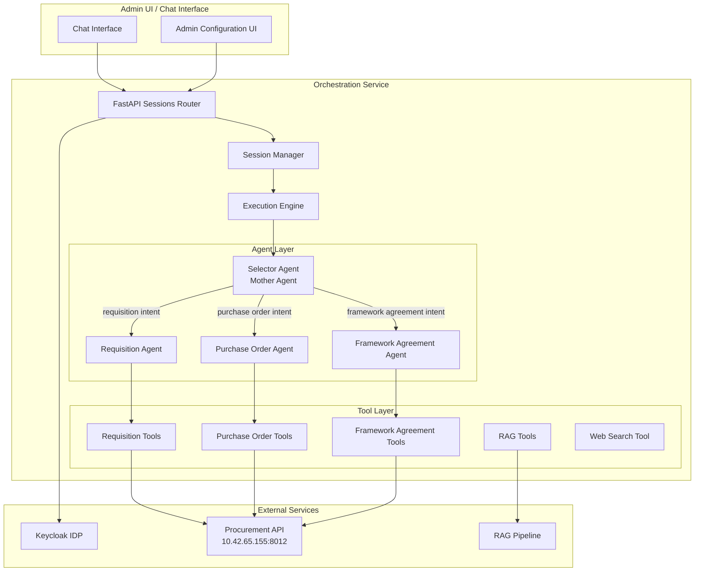

# Design Document: Multi-Agent Procurement Chatbot

## Overview

This document describes the design for a Multi-Agent Procurement Chatbot system that implements a hierarchical agent architecture. The system uses a Selector (Mother) Agent to analyze user queries and route them to specialized domain agents (Requisition Agent, Purchase Order Agent, Framework Agreement Agent). Each specialized agent has access to specific API tools for querying procurement data.

The architecture follows the existing Autogen 0.2-based execution engine pattern, extending it with a new "selector" workflow pattern that enables dynamic agent routing based on intent classification.

## Architecture



### Workflow Pattern: Selector-Based Routing

The system introduces a new workflow pattern called `selector` that enables dynamic agent routing:

1. User sends message to session
2. Selector Agent analyzes intent and determines target agent
3. Selector Agent returns routing decision with extracted parameters
4. Execution Engine routes to appropriate specialized agent
5. Specialized Agent executes with relevant tools
6. Response returned to user

## Components and Interfaces

### 1. Selector Agent (Mother Agent)

The Selector Agent is responsible for:
- Analyzing user intent from natural language queries
- Classifying queries into domains: requisition, purchase_order, framework_agreement, general
- Extracting relevant parameters (requisition numbers, item codes, etc.)
- Returning structured routing decisions

**System Prompt Structure:**
```
You are a procurement assistant router. Analyze user queries and determine:
1. The domain: requisition, purchase_order, framework_agreement, or general
2. The specific intent within that domain
3. Any parameters mentioned (requisition numbers, item codes, etc.)

Respond in JSON format:
{
  "domain": "requisition|purchase_order|framework_agreement|general",
  "intent": "specific_intent_name",
  "parameters": {"key": "value"},
  "requires_clarification": false,
  "clarification_prompt": null
}
```

### 2. Specialized Agents

#### Requisition Agent
- **Tools:** get_requisition_info, get_self_requisition_info, get_requisition_info_with_initiator
- **Intents:** check_status, show_latest, get_initiator_info, get_details

#### Purchase Order Agent
- **Tools:** get_purchase_order_info, get_self_purchase_order_info
- **Intents:** check_status, is_approved, show_latest

#### Framework Agreement Agent
- **Tools:** get_all_framework_agreement_no_by_item, get_total_framework_agreement, get_framework_agreement_with_brand_by_item
- **Intents:** check_availability, get_count, get_brands, get_specifications, get_moq

### 3. Workflow Configuration Schema

The workflow configuration must be identical whether created via backend JSON or frontend UI:

```json
{
  "id": "procurement_chatbot",
  "name": "Procurement Chatbot",
  "description": "Multi-agent chatbot for procurement queries",
  "pattern": "selector",
  "entry_agent_id": "selector_agent",
  "enabled": true,
  "selector_config": {
    "routing_agents": {
      "requisition": "requisition_agent",
      "purchase_order": "purchase_order_agent",
      "framework_agreement": "framework_agreement_agent"
    },
    "default_agent": "selector_agent",
    "max_routing_attempts": 3
  },
  "max_turns": 10,
  "summary_method": "last_msg",
  "workflow_type": "chatbot",
  "persistence": "mongo_only"
}
```

### 4. Agent Configuration Schema

```json
{
  "id": "selector_agent",
  "type": "conversable",
  "name": "SelectorAgent",
  "system_message": "...",
  "llm_config": {
    "provider_id": "openrouter",
    "model": "openai/gpt-oss-20b",
    "temperature": 0.3
  },
  "human_input_mode": "NEVER",
  "tools": [],
  "is_selector": true,
  "routing_config": {
    "domains": ["requisition", "purchase_order", "framework_agreement"],
    "output_format": "json"
  }
}
```

### 5. API Tool Configuration

Tools are configured with the existing `api_tool_executor` pattern:

```json
{
  "id": "get_requisition_info",
  "name": "find_requisition_by_requisition_no",
  "entrypoint": "src.tools.api_tool_executor:execute_api_tool",
  "settings": {
    "type": "api",
    "api_url": "http://10.42.65.155:8012/api/v1/requisition",
    "http_method": "GET",
    "forward_user_context": true
  }
}
```

## Data Models

### Routing Decision Model

```python
@dataclass
class RoutingDecision:
    domain: str  # requisition, purchase_order, framework_agreement, general
    intent: str  # specific intent within domain
    parameters: Dict[str, Any]  # extracted parameters
    requires_clarification: bool
    clarification_prompt: Optional[str]
    confidence: float  # 0.0 to 1.0
```

### Selector Workflow Config Model

```python
@dataclass
class SelectorConfig:
    routing_agents: Dict[str, str]  # domain -> agent_id mapping
    default_agent: str  # fallback agent
    max_routing_attempts: int  # prevent infinite loops
```

## Correctness Properties

*A property is a characteristic or behavior that should hold true across all valid executions of a system-essentially, a formal statement about what the system should do. Properties serve as the bridge between human-readable specifications and machine-verifiable correctness guarantees.*

### Property 1: Intent Routing Correctness
*For any* user query containing procurement-related keywords (requisition, purchase order, framework agreement, FA, PO, REQ), the Selector Agent SHALL route to the corresponding specialized agent based on the detected domain.
**Validates: Requirements 1.1, 2.1, 3.1, 4.1, 5.1, 6.1, 7.1, 8.1**

### Property 2: Missing Parameter Prompting
*For any* query that requires a specific identifier (requisition number, PO number, item code) but does not contain one, the system SHALL return a clarification prompt requesting the missing parameter.
**Validates: Requirements 1.3, 3.2, 4.2, 7.2**

### Property 3: Response Field Completeness
*For any* successful API response, the formatted output SHALL contain all required fields as specified in the requirements (e.g., requisitionNo, status, projectInfo for requisitions).
**Validates: Requirements 1.4, 2.3, 3.3, 4.3, 5.3, 6.2, 6.3, 7.3, 8.2**

### Property 4: Configuration Parity
*For any* workflow configuration, creating it via backend JSON SHALL produce identical execution behavior as creating it via frontend Admin UI.
**Validates: Requirements 9.1, 9.2**

### Property 5: User Context Forwarding
*For any* API tool call, the request SHALL include x-client-username and x-client-ref headers extracted from the authenticated user's JWT token.
**Validates: Requirements 10.1, 10.2**

### Property 6: Tool Reference Validation
*For any* agent configuration that references tools, the system SHALL validate that all referenced tool IDs exist in the tools configuration.
**Validates: Requirements 9.4**

### Property 7: Configuration Cleanup Validation
*For any* system configuration after cleanup, the tools list SHALL only contain API tools, RAG tools, and web search tools (no calculator, code execution tools).
**Validates: Requirements 11.1, 11.2, 11.3**

## Error Handling

### Authentication Errors
- Token acquisition failure: Log error, return user-friendly message
- Token expiration: Attempt refresh, fail gracefully if unsuccessful
- Invalid credentials: Return clear error message without exposing details

### API Errors
- Timeout: Return "Service temporarily unavailable" message
- 404 Not Found: Return "No data found" message specific to query type
- 500 Server Error: Log details, return generic error to user

### Routing Errors
- Unrecognized intent: Route to Selector Agent for clarification
- Max routing attempts exceeded: Return error and reset conversation
- Agent not found: Log configuration error, return system error message

## Testing Strategy

### Property-Based Testing Framework
- **Library:** Hypothesis (Python)
- **Minimum iterations:** 100 per property test

### Unit Tests
- Selector Agent intent classification
- Parameter extraction from queries
- Response formatting functions
- Configuration validation

### Property-Based Tests
Each correctness property will be implemented as a property-based test:

1. **Intent Routing Test:** Generate random procurement queries, verify routing decisions
2. **Missing Parameter Test:** Generate queries without required params, verify prompts
3. **Response Formatting Test:** Generate API responses, verify field presence
4. **Configuration Parity Test:** Generate configs, create via both methods, compare execution
5. **User Context Test:** Generate requests with user context, verify header forwarding
6. **Tool Validation Test:** Generate agent configs with tool refs, verify validation
7. **Cleanup Validation Test:** Generate tool configs, apply cleanup, verify filtering

### Integration Tests
- End-to-end workflow execution with mock APIs
- Frontend-backend configuration synchronization
- Authentication flow with Keycloak

### Test Annotations
All property-based tests MUST include:
```python
# **Feature: multi-agent-procurement-chatbot, Property {N}: {property_text}**
# **Validates: Requirements X.Y**
```
